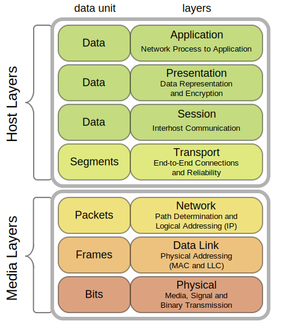
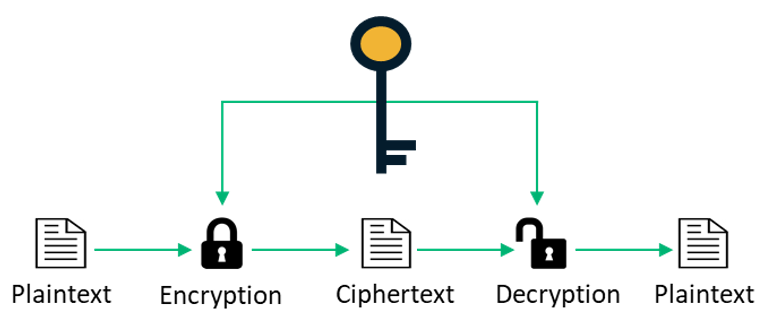

# Introducció

### Reconeixement de l'autor


   
    
**Desplegament d'aplicacions web** by [Toni Jiménez](https://t-jimenez.gitbook.io/desplegament-d-aplicacions-web/) is licensed under a [Creative Commons Reconocimiento-NoComercial 4.0 Internacional License](http://creativecommons.org/licenses/by-nc/4.0/).

**Toni Jiménez** [**&lt;t.jimenez@escolesnuria.cat**](mailto:t.jimenez@escolesnuria.cat)**&gt;**


Començarem explicant l'entorn de qualsevol desplegament, cal fer primer un repàs de tot allò.

## Model OSI

Segons la Viquipèdia

_És un estàndard que té per objectiu aconseguir interconnectar sistemes de procedència diferent perquè aquests poguessin intercanviar informació sense cap tipus d'impediments a causa dels protocols amb els que aquests operaven de forma pròpia segons el seu fabricant._

El model de capes OSI, representa un estandar però serveix de referència per estudiar un procés de COMUNICACIÓ. 

El procés que acompanya qualsevol operació amb una aplicació web es basa en aquest model, per tant la seva utilitat és innegable.

### Comunicació a través d'un exemple.

Quan s'estableix una comunicació entre dos equips cal tenir en compte el rol que assumeix cadascú en la comunicació, és a dir, si parlem de l'emissor que transmet el missatge o bé el receptor que rep el missatge. En termes de computació, podem parlar també del **client**, qui sol·licita un recurs \( creant un llenguatge associat per indicar qui, què i com vol el recurs - **protocol**\) i servidor, qui ofereix el recurs \(creant un llenguatge associat per indicar què, a qui i com pot oferir el recurs\).

### El model OSI es construeix per capes

Imaginem una comunicació típica, una consulta a Internet, per exemple una consulta a la pàgina de la nostra escola:

**`https://escolesnuria.cat`** aquí som clients i qui ens servirà la pàgina es diu servidor.

Pensem en el procediment:

**Request** al servidor que conté la pàgina HTML que ens servirà el servidor seguint la nostra petició. protocol HTTP

Servidor a través d'un programari, processa i extreu la pàgina HTML, i **respon** al client a través de protocol HTTP.

Tot aquest procediment es realitza de forma immediata \(o no\) de manera que si hem de pensar com es fa, ens hem de plantejar un model d'estudi per capes.

Les dades passen en sentit descendent a través de les capes transformant-se \( encapsulació \) fins poder arribar al medi físic on es transmetre a l'equip de destinació a través d'impulsos elèctrics. En arribar a la destinació es procedeix de nou a encapsular segons el protocol de cada capa per arribar finalment a destinació.

## SSH. Gestió remota

Si volem una gestió segura a través de la shell, hem d'utilitzar un protocol que ens permeti encriptar la comunicació. SSH , Secure shell ens permet assegurar la comunicació   entre host i client a través de l'intercanvi de claus.

**Host** es refereix a el servidor remot a què estàs intentant accedir, mentre que el **client** és l'equip que estàs utilitzant per accedir a l'amfitrió. Hi ha tres tecnologies de xifrat diferents utilitzades per SSH:

1. Xifrat simètric  
2. Xifrat asimètric  
3. Hashing

La forma en què funciona SSH és mitjançant l'ús d'un model client-servidor per permetre l'autenticació de dos sistemes remots i el xifrat de les dades que passa entre ells.

SSH opera al port TCP 22 per defecte \(encara que això es pot canviar si cal\). El host \(servidor\) escolta al port 22 \(o qualsevol altre port SSH assignat\) per a les connexions entrants. Organitza la connexió segura mitjançant l'autenticació de client i l'obertura de l'entorn de shell correcte si la verificació té èxit.

#### El client té la paraula

El client ha d'iniciar la connexió SSH iniciant el protocol TCP amb el servidor, assegurant una connexió simètrica segura, verificar si la identitat mostrada pel servidor coincideix amb els registres anteriors \(normalment gravats en un arxiu de magatzem de claus RSA\) i presenta les credencials d'usuari necessàries per autenticar la connexió.

Hi ha dues etapes per establir una connexió: primer els dos sistemes han d'acordar estàndards de xifrat per protegir futures comunicacions, i segon, l'usuari ha autenticar-se. Si les credencials coincideixen, es concedeix accés a l'usuari.

## HTTP 

En els protocols basats en el model client-servidor, com és el cas de l'HTTP, una sessió consta de tres fases: 

1. El client estableix una connexió TCP \(o la connexió corresponent si la capa de transport correspon a un altre protocol\). 
2. El client mana la seva petició, i espera per la resposta. 
3. El servidor processa la petició, i respon amb un codi d'estat i les dades corresponents. 

A partir del protocol HTTP/1.1 la connexió, no es tanca en finalitzar la tercera fase, i el client pot continuar realitzant peticions. Això significa que la segona i tercera fase, poden repetir-se qualsevol nombre de vegades.

