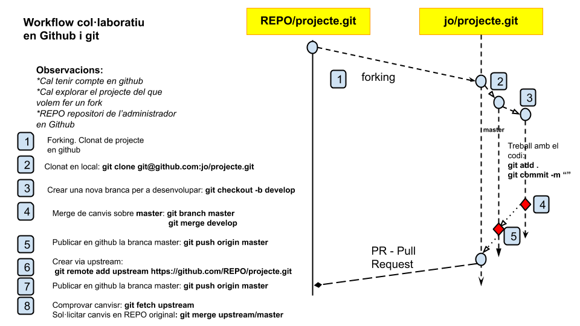

# Git i workflow

## Introducció a git <a href="#introduccion-a-git" id="introduccion-a-git"></a>

Git és un sistema de control de versions distribuït que es diferencia de la resta en la manera en què modela les seves dades. La majoria dels altres sistemes emmagatzemen la informació com una llista de canvis en els arxius, mentre que Git modela les seves dades més com un conjunt d'instantànies d'un mini sistema d'arxius.


### Els tres estats  <a href="#los-tres-estados" id="los-tres-estados"></a>

Git té tres estats principals en què es poden trobar els teus arxius: confirmat (Committed), modificat (modified), i preparat (staged). Confirmat vol dir que les dades estan emmagatzemades de manera segura en la teva base de dades local. Modificat vol dir que has modificat l'arxiu però encara no ho has confirmat a la teva base de dades. Preparat vol dir que has marcat un arxiu modificat en la seva versió actual perquè vagi en la teva propera confirmació.

Això ens porta a les tres seccions principals d'un projecte de Git: directori de Git (Git directory), el directori de treball (working directory), i l'àrea de preparació (staging area).


### Fluxos de treball distribuïts amb git  <a href="#flujos-de-trabajo-distribuidos-con-git" id="flujos-de-trabajo-distribuidos-con-git"></a>

Hem vist en què consisteix un entorn de control de versions distribuït, però més enllà de la simple definició, hi ha més d'una manera de gestionar els repositoris. Aquests són els fluxos de treball més comuns en Git.

#### Flux de treball centralitzat  <a href="#flujo-de-trabajo-centralizado" id="flujo-de-trabajo-centralizado"></a>

Hi ha un únic repositori o punt central que guarda el codi i tothom sincronitza el seu treball amb ell. Si dos desenvolupadors clonen des del punt central, i tots dos fan canvis; tan sols el primer d'ells en enviar els seus canvis de tornada ho podrà fer netament. El segon desenvolupador haurà de fusionar prèviament el seu treball amb el de el primer, abans d'enviar, per evitar el sobreescriure els canvis de el primer


#### Flux de treball del Gestor deIntegracions <a href="#flujo-de-trabajo-del-gestor-de-integraciones" id="flujo-de-trabajo-del-gestor-de-integraciones"></a>

En permetre múltiples repositoris remots, en Git és possible tenir un flux de treball on cada desenvolupador tingui accés d'escriptura al seu propi repositori públic i accés de lectura als repositoris de tots els altres. Habitualment, aquest escenari sol incloure un repositori canònic, representant "**oficial**" de el projecte.



Aquest model es va posar molt de moda arran de  GitHub, que es veurà més endavant.



#### Flux de treball amb Dictador i tinents  <a href="#flujo-de-trabajo-con-dictador-y-tenientes" id="flujo-de-trabajo-con-dictador-y-tenientes"></a>

És una variant de el flux de treball amb múltiples repositoris. S'utilitza generalment en projectes molt grans, amb centenars de col·laboradors. Un exemple molt conegut és el de el **nucli de Linux**. Uns gestors d'integració s'encarreguen de parts concretes de l'repositori; i s'anomenen tinents. Tots els tinents rendeixen comptes a un gestor d'integració; conegut com el dictador benevolent. El repositori del  dictador benevolent és el repositori de **referència**, del què recuperen (**pull**) tots els col·laboradors.


## Aspectes bàsics de Git  <a href="#aspectos-basicos-de-git" id="aspectos-basicos-de-git"></a>

### **GiT NO ÉS GitHub**

Git és un gestor de versions utilitzat primàriament des de la **terminal** pensat per controlar el progrés d'un projecte programari entre diversos components d'un equip i facilitar el seu desenvolupament.

GitHub és una **plataforma en línia** que permet gestionar dipòsits de forma visual i interactuar amb els repositoris d'altres usuaris, que comparteixen el seu treball públicament.

A part de GitHub, hi ha molts altres clients de Git, com GitLab, GitKraken, OpenHub i altres dipòsits creats individualment, com el AUR (Arch User Repository).&#x20;

### **CONFIGURACIÓ DE GIT**

Atenció, segueix les instruccions per descarregar git en funció del teu sistema operatiu:

* Linux: Segueix [aquest enllaç](https://git-scm.com/download/linux) i executa a la terminal les ordres corresponents al teu distro.
* OSX: Segueix [aquest enllaç](https://git-scm.com/download/mac) i segueix les instruccions d'instal·lació.
* Windows: Segueix [aquest enllaç](https://gitforwindows.org/) i segueix les instruccions d'instal·lació.

Un cop instal·lat, executa les següents ordres a la terminal:

```sh
# Introdueix un nom d'usuari
git config --global user.name "Usuari"
# Introdueix un email d'usuari
git config --global user.email "usuari@email.com"
# Configura la terminal per que mostri colors al text
git config --global color.ui auto
```


Global, indica configuració vàlida per a l'usuari de sistema actual. Al directori personal es desa dins **.gitconfig**


El teu nom i correu d'usuari són els que t'identificaran a l'actualitzar el repositori. No has de registrar-te enlloc, només cal que introdueixis els que t'agradin. Però, tot i que no han de ser obligatòriament els de GitHub o la plataforma que utilitzis, **resulta més fàcil identificar-te si fas servir les mateixes credencials**.

### **ORDRES GIT**

**Ens ajudarem del següent cheat-sheet, si vols t'ho pots imprimir.**

****[**http://ndpsoftware.com/git-cheatsheet.html**](http://ndpsoftware.com/git-cheatsheet.html)****

#### **git init**

Per començar a treballar en un nou repositori vam crear una carpeta amb el nom del nostre projecte (pot variar) i executem git init dins d'ella.

Aquesta ordre crea un directori .git,que conté informació sobre l'estat de l'repositori en cada punt de el temps registrat, i inicialitza el repositori en la branca master.

Tot i que les tractarem més endavant i no són estrictament necessàries per a la gestió d'un repositori, és important saber que les branques són la metàfora visual que utilitza git per expressar la línia de temps de les actualitzacions d'un repositori. Tots els repositoris tenen una branca principal anomenada màster.

Per representar l'evolució d'un repositori utilitzarem un gràfic en què el temps es representa com una línia que apunta cap endavant, el moment actual com> i l'inici de l'repositori com O:

```sh
init  ara
REPO:  O------>
```

#### **git status**

Per consultar els fitxers modificats des de l'última actualització de l'repositori executem `git status` dins d'ell mateix.

Aquesta ordre ens mostra un text similar a el següent:

```sh
On branch master

No commits yet

Untracked files:
  (use "git add <file>..." to include in what will be committed)
	Makefile
	README.md
	src/

nothing added to commit but untracked files present (use "git add" to track)
```

****

#### **git add**

Amb la informació de l'ordre anterior podem triar els fitxers que volem afegir al repositori usant l'ordre `git add<fitxers>`.

Cada vegada que modifiquem un fitxer s'actualitzen data i hora d'última modificació, de manera que git deixa de reconèixer-los com pertanyents a l'últim estat de l'repositori (pertanyen a un punt posterior en el temps). Amb **git add** ens assegurem d'afegir un a un tots els fitxers que volem actualitzar. Un avantatge d'aquesta ordre és que ens permet afegir directoris (--all o .)i el seu contingut de forma recursiva, per la qual cosa no cal afegir un a un tots els fitxers de la mateixa carpeta si s'afegeix el propi directori.

#### **git mv i git rm**

A l'igual que git no actualitza fitxers si no s'afegeixen manualment, els fitxers eliminats o desplaçats no s'actualitzen automàticament, ja que la versió anterior del fitxer, abans d'aquestes operacions segueix estant registrada en el repositori. Això vol dir que, per molt que es esborrem un fitxer, la seva inexistència actual no és suficient per eliminar: cal fer-ho manualment.

L'ordre `git mv`,a l'igual que l'ordre POSIX **mv**, ens permet canviar el nom i desplaçar fitxers al llarg de l'repositori i que aquests moviments queden registrats en ell. Igualment, `git rm`,a l'igual que l'ordre POSIX **rm**, ens permet eliminar fitxers de l'arxiu.


**ATENCIÓ**!: Aquestes ordres tenen efectes tangibles sobre els fitxers de l'arxiu. Esborrar-los o desplaçar-los amb aquestes ordres esborrarà o desplaçarà els fitxers de directori.


#### **git restore**

A l'afegir fitxers per a la següent actualització del repositori passen a estar en estat **staged** (escenificat o preparatds per commit). Això vol dir que, fins que no es faci efectiva l'actualització, els canvis sobre aquests fitxers estan en consideració per a ella.

Si decidíssim que no volem afegir alguns dels fitxers a la següent actualització, podem usar l'ordre git restore --staged \<fitxers> per no incloure'ls però que conservin els canvis:

```sh
git status
# On branch master
# Changes to be committed:
#   (use "git restore --staged <file>..." to unstage)
#         new file:   aquest_no
#         new file:   aquest_si

git restore --staged aquest_no

git status
# On branch master
# Changes to be committed:
#   (use "git restore --staged <file>..." to unstage)
#         new file:   aquest_si
#
# Untracked files:
#   (use "git add <file>..." to include in what will be committed)
#         este_no

ls -a
# .  ..  aquest_no  aquest_si  .git
```

#### **git commit**

Un cop estem segurs que hem inclòs els fitxers que volem actualitzar utilitzem l'ordre _`git commit -m "Missatge d'actualització"`_` ``-m [ "Descripció de l'actualització"]` per fer efectius aquests canvis. Com pots veure, aquesta ordre admet dues cadenes de caràcters:

* **Missatge d'actualització**: Un missatge curt (per convenció 50 o menys caràcters) sobre els canvis realitzats.
* **Descripció de l'actualització**: Un bloc de text opcional en el qual s'expliquen detalladament els canvis realitzats.

```
git commit -m "[META] Actualitzat Makefile i .gitignore" -m "Afegit llegibilitat al Makefile i afegits fitxers a ignorar al .gitignore."
```

Un cop realitzat el commit, el que fins ara hem anomenat actualització per no dificultar la lectura, els seus canvis es guarden en el registre de commits, que veurem més endavant.

Afegit el **commit A**, el repositori quedaria així:

```sh
       init   ara
REPO:  O---A--->
```

&#x20; ****  \
****

L'últim commit realitzat( A en aquest cas) rep el nom de **HEAD.**


**ATENCIÓ !:** Desfer aquests canvis és molt difícil, molt més treballant amb un repositori remot (veure següent apartat). Tria molt bé quins canvis vols deixar reflectits en els  commits.


****

#### **git log**

Segons anem fent commits, aquests es van guardant en el fitxer .git per registrar l'evolució de l'repositori.

Si executem `git log` accedim una interfície en la qual podem llegir els commits realitzats fins al moment:

```sh
commit 9d0431253c006222eaae2412c5d4ae065dc7449a
Author: Usuari <usuari@correu.com>
Date:   Wed Oct 9 13:06:49 2019 +0200

    A
```

Naveguem aquesta interfície amb les tecles de direcció, `j` i `k` o Av Pàg i Re Pàg i la tanquem amb `q.`

Com pots veure, el commit realment no té el nom que li posem, sinó un hash llarguíssim. Aquest és un identificador únic amb el qual ens referim inequívocament a cada un dels commits. En general, en tenim prou amb usar únicament els set primers números per a això.

#### **git whatchanged**

Mentre que git log ens mostra únicament el títol i data i hora dels commits que s'han realitzat fins ara, no ens mostra els canvis realitzats.

Per a això fem servir l'ordre **`git whatchanged[commit]`**,que ens permet veure quins canvis s'han realitzat fins al commit commit (inclosos) o fins al present.

```
commit 9d0431253c006222eaae2412c5d4ae065dc7449a
Author: Usuari <usuari@correu.com>
Date:   Wed Oct 9 13:06:49 2019 +0200

    A

:000000 100644 0000000 e69de29 A        README.md
```


En aquest cas se'ns indica que s'ha creat el fitxer README.md. La lletra a la dreta el nom de el fitxer ens indica el canvis que s'ha realitzat:

* **A: Creat (added).**
* **D: Eliminat (deleted).**
* **M: Modificat (modified).**

#### **git diff**

Amb `git log` i `git whatchanged` podem veure quins fitxers s'han canviat en cada commit. Però. Quins han estat aquests canvis?

L'ordre **`git diff <commit_inicio> [commit_fin`**] ens permet veure quins canvis s'han realitzat des commit\_inici  fins commit\_fin. Si no s'especifica commit\_fin, aquest serà **HEAD**.

Aquests canvis vénen fitxer per fitxer en verd si representen una addició i en vermell si representen una eliminació.

#### **git remote**

Fins ara hem estat treballant amb un repositori local, però el potencial d'git s'aprofita completament a l'treballar amb un repositori remot.

Per associar nostre local a un remot utilitzem l'ordre **`git remote add origin <url>`**, sent **origin** l'àlies que li donem al remot per convenció. És imperatiu que el remot estigui inicialitzat abans d'intentar realitzar aquesta acció, ja que no funcionarà d'una altra manera.

Al  crear un repositori en GitHub, que no és més que crear un allotjament per a un remot, se'ns indica que, per enllaçar nostre local a l'remot, hem de fer servir **git remote add** seguit de la url de l'remot que acabem de crear.

#### **git push**

Les actualitzacions que fem al nostre local no queden registrades automàticament en el remot: hem de enviar-les nosaltres mateixos.

Per enviar una actualització a l'remot fem servir l'ordre **`git push <remot><branca>`.**Com que encara no hem explicat les branques, estem treballant des de i enviant cap a la branca master. Per tant, l'ordre que hem d'executar per actualitzar el remot és **`git push origin master`**,que sincronitza la branca màster de l'remot amb la nostra branca master local.

Per exemple, suposem que hem afegit un remot però encara no hem fet push des del local als commits A, B i C.L'estat de tots dos seria el següent:

```sh
        init           ara
REMOT:  O--------------->

LOCAL:  O---A---B---C--->
```

&#x20;  ****  &#x20;

Si fem push, l'estat canviaria a el següent:

```
        init           ara
REMOT:  O---A---B---C--->

LOCAL:  O---A---B---C--->
```

&#x20;****&#x20;

Amb aquest gràfic podem apreciar dues coses molt importants:

* el repositori no emmagatzema el moment en què es fa push, doncs la dada rellevant en aquest cas seria la data i hora de l'últim commit.
* El remot no actualitza els commits a la data i hora de l'push, sinó que els emmagatzema de la mateixa manera que al local, ja que no és més que una còpia remota de l'repositori.

#### **git pull**

De la mateixa manera que podem empènyer els canvis a l'remot, podem tirar d'ells al nostre local.

Si volem actualitzar canvis del remot que s'han fet a partir d'un altre local, utilitzem **git pull** per sincronitzar el nostre local amb la versió més recent de tot el remot.

Per exemple, vegem el gràfic anterior considerant un nou local en una altra màquina. Per això, anomenarem local1 al que abans anomenem LOCAL1 i local2 a el nou local:

```
        init               ara
REMOT :  O---A---B---C---D--->

LOCAL1:  O---A---B---C------->

LOCAL2:  O---A---B---C---D--->
```

&#x20;     ****      \
****

Com podem veure, **local2 ha fet el commit D i push a màster**, de manera que el remot està actualitzat amb el seu local, però no amb el de local1.Per esmenar això, **local1 fa pull** abans de seure a treballar i l'estat dels dipòsits passaria a ser el següent:

```
        init               ara
REMOTO:  O---A---B---C---D--->

LOCAL1:  O---A---B---C---D--->

LOCAL2:  O---A---B---C---D--->
```

&#x20;    ****    &#x20;

Ara local1 pot posar-se a treballar coneixent tots els canvis realitzats per local2.

#### **git clone**

En l'apartat anterior, local2 tenia una còpia local de l'repositori sincronitzada amb el remot. Com l'ha aconseguit?

Per crear una còpia local d'un remot utilitzem l'ordre **`git clone <url> .git[directori]`**. Si no especifiquem un directori en què clonar el repositori, es clona en el directori de treball actual.

#### **git checkout**

Al treballar amb un repositori podem tenir diverses branques de desenvolupament. La utilitat de tenir diferents branques és que es poden dividir les activitats a realitzar sobre els fitxers de forma exclusiva. Per exemple, podem tenir una branca **dev** **per a canvis inestables**.

Per crear una branca fem servir l'ordre **`git checkout -b<branca>`**. Això ens crea la branca que volem i ens canvia automàticament a ella.

Prenguem com a exemple un repositori en el qual màster, l'única branca que el compon, té dos commits A i B:

```
      init        ara
REPO:  O---A---B--->
```

&#x20;  ****  &#x20;

Ara fem `git checkout -b dev` per a crear la branca dev i fem en ella un commit C:

```
              init
REPO: master:  O---A---B----->
                        \   ara
                   dev:  C--->
```

&#x20;   ****   &#x20;

Amb aquest gràfic podem apreciar dues coses molt importants:

* la branca no apareix en un punt dedicat de el temps, sinó just després de l'últim commit realitzat, ja que no importa si la branca es va fer just després o passat un mes si no hi ha més commits.
* La branca va d'un commit a un altre, ja que el normal és crear-la per fer commit sobre ella, encara que es pot crear una branca sense fer commits.

Un exemple d'una branca sense commits seria una que fes una instantània (snapshot) fàcilment accessible en un moment de el temps:

```
              init
REPO: master:  O---A---B---C---D--->
                        \         ara
                  2020:  x
                         fi
```

&#x20;          ****          &#x20;

#### **git branch**

Per consultar la llista de branques que componen un repositori podem usar l'ordre `git branch`, que ens retorna una llista de totes les branques marcant la nostra amb un **\***.

Per eliminar una branca fem servir l'ordre **`git branch -d<branca>`**.Prenguem com a exemple el gràfic de l'apartat anterior:

```
              init
REPO: master:  O---A---B----->
                        \    ara
                   dev:  C--->
```

Si eliminéssim la branca després del commit C, aquest seria l'estat del repositori:

```
             init
REPO: master:  O---A---B----->
                        \   ara
                   dev:  Cx
                         fi
```

Això no elimina els canvis realitzats sobre la branca abans de realitzar l'eliminació, només deixa de registrar canvis sobre ella i mostrar-la com branca activa.

#### **git switch**

Per canviar de branca utilitzem **`git switch<branca>`**, sent \<branca> una branca ja existent. D'aquesta manera podem fer commits en les dues branques.

Per exemple, suposem que tenim el repositori de l'apartat anterior:

```
              init
REPO: master:  O---A---B----->
                        \   ara
                  *dev:  C--->
```

Com es pot veure, ens trobem a la branca dev. Si fem un commit D en dev,  `git switch master` i un commit I,quedaria així:

```
               init
REPO: *master:  O---A---B---------E--->
                         \           ara
                    dev:  C---D------->
```

És important apreciar que els commits B i E s'han separat per donar espai a C i D i crear una sensació de progressió temporal. Això és únicament un detall de la representació gràfica de les dues branques, ja que a git no li importa el moment de realització de l'commit dins de la pròpia branca.

#### **git merge**

Després de portar un temps treballant amb una branca voldrem unir els seus canvis als de màster o els d'una altra branca.

Per a això, ens col·loquem en la branca que volem actualitzar i executem **`git merge <branca> -m "Missatge del'commit"`**.Tot i que es pot fer merge sense un missatge de commit, és millor pràctica indicar amb un el moment d'unió de les dues branques per facilitar la navegació al llarg de l'repositori.

Prenguem com a exemple el següent repositori:

&#x20; **** &#x20;

```
               init
REPO: *master:  O---A---B---D----->
                         \        ara
                    dev:  C---E--->
```

Estant en màster executem **`git merge dev -m "E"`**.L'estat del repositori passa a ser el següent:

```
              init
REPO: *master:  O---A---B---D---F------>
                         \     /     ara
                    dev:  C---E-------->
```

Això ens indica que tots els canvis fets des de **B** fins **F** en la branca dev ara estan integrats en màster, no fent falta incloure'ls en la mateixa.

De la mateixa manera, és important també veure la correlació temporal entre el commit D i els commits C i E. Encara que en la mateixa branca git no té en compte la data i hora dels commits, sí que en té en compte si són de diferents branques, de manera que sap que C s'ha creat abans que D i aquest abans que E:


```
               init
REPO: *master:  O---A---B---D---F------>
                         \| | |/     ara
                    dev:  C---E-------->
```

#### **git rebase**

En contraposició a la unió de dues branques, podem fer un **`rebase`** d'una branca amb tots els commits d'una altra fins al moment.

Col·locant-nos en la branca sobre la qual volem fer rebase, executem **`git rebase <branca>`** per unir tots els commits vam realitzar en la branca branca a la nostra previ a tots els commits de la branca actual que no s'han unit a la branca branca. És més fàcil veure-ho visualment:

```
              init
REPO: master:  O---A---B---D----->
                        \      ara
                  *dev:  C---E--->
```

Trobant-nos en la branca dev, executem **`git rebase master`**:


```
              init
REPO: master:  O---A---B---D--------->
                            \      ara
                      *dev:  C'--E'-->
```

En la representació gràfica, els commits C i E passen a ser C 'i E' respectivament. En  realitat, els commits no varien el seu contingut, però sí el contingut aliè a ells amb el qual treballen (com pot ser la millora d'un algoritme que no s'ha modificat en ells).

Executant **git log** podem veure que, tot i que les dates no coincideixen en l'ordre cronològic, l'ordre dels commits coincideix amb el de l'gràfic:

```
commit 71c9c8bf989189668237a9abfb7b58da5eb72f48 (HEAD -> dev)
Author: Usuari <usuari@correo.com>
Date:   Wed Oct 9 18:53:47 2019 +0200

    E

commit 65c35a92220ff7a8f1bbf59841621ec69e3689d2 (master)
Author: Usuari <usuari@correo.com>
Date:   Wed Oct 9 18:54:01 2019 +0200

    D

commit 26767459e2fde0d3f9dd3b04be4991249e14a8c2
Author: Usuari <usuari@correo.com>
Date:   Wed Oct 9 18:51:30 2019 +0200

    C
```

****\
****

Tingues en compte que, en el log, els commits C 'i E' apareixen com C i E respectivament.

#### **git fetch**

En fer pull des d'un remot, git descarrega els commits que han d'actualitzar-se i fa merge a les branques corresponents.

Per **evitar fer merge i simplement consultar** els canvis realitzats sense actualitzar el nostre repositori fem servir l'ordre **`git fetch[branca]`**.Per defecte, git fetch descàrrega tots els commits de origin.

Després descarregar els commits, es mostren amb el prefix **\* \[newtag]**, permetent-nos executar `git log` sobre ells.

#### **git revert**

Si s'han comès errors en els últims commits, el més assenyat és esborrar tots els fitxers que hem afegit i fer un commit que torni a l'estat anterior. No obstant això, és possible que hi hagi fitxers que s'hagin actualitzat a trossos i aquesta acció consumeixi massa temps.

L'ordre **`git revert <commit> -m "Missatge de l'commit"`** ens permet realitzar un commit en què es torni a l'estat en què estava el repositori just després de fer el commit.

### **FUNCIONS DE GitHub**

#### **Crear un remot**

Per crear un remot en GitHub podem anar a la pantalla d'inici oa la nostra llista de repositoris i prémer el botó de new en verd. A l'crear un repositori GitHub ens diverses eleccions:

**Públic o priva**t: Els repositoris amb un remot públic són visibles per a tothom i els privats, només pels que tinguin permisos de col·laboració.

Crear **README.md**: Inicialitza el repositori amb un fitxer README.md que conté el títol de la mateixa.

Crear .**gitignore**: Inicialitza el repositori amb un fitxer .gitignore.

L'ideal és no inicialitzar el repositori des GitHub i fer-ho des de la terminal. Si no seleccionem cap dels dos últims fitxers, GitHub ens donarà instruccions per afegir un remot al nostre local (les mateixes que vam veure anteriorment).

#### **Gestionar un remot**

En un primer cop d'ull, GitHub ens permet veure el nombre de commits, branques, releases, contibutores i la llicència del nostre repositori; així com accedir a les **issues i pull request** (que veurem més endavant), els projectes (que són una plataforma de [SCRUM,](https://en.wikipedia.org/wiki/Scrum\_\(software\_development\))la wiki i les opcions de l'repositori.

La wiki és una pàgina en la qual es pot (i ha de) escriure documentació sobre el dipòsit, els seus usos, funcions i tot allò que faciliti el treball amb el mateix.

Les opcions ens permeten canviar el nom i opcions bàsiques de l'remot (fins i tot eliminar), afegir col·laboradors i formar equips, afegir integració amb serveis de tercers i gestionar la protecció de les branques. Aquesta protecció permet als adminsitradores de l'repositori crear restriccions perquè els canvis d'altres usuaris no puguin ser acceptats sense consens de l'equip.

#### **Issues**

Si et trobes amb un **problema** a l'utilitzar el contingut d'un repositori pots enviar una issue explicant aquest problema de forma detallada. Després d'això, un administrador de l'repositori començarà una **discussió** pública amb tu tant per ajudar-te a solucionar-la com per arreglar allò que t'està causant el problema.

Molts repositoris incorporen seccions específiques en l'apartat de issues per gestionar més àgilment a què es refereix cadascuna i poder assignar així què administrador del fòrum s'ocupa de resoldre-les.

#### **Fork**

Per treballar amb un repositori és imperatiu tenir accés de col·laboració a aquest. Imagina el caos que crearia que tothom pogués escriure al repositori de Linux! Per poder editar un repositori aliè, es va crear una còpia pròpia mitjançant un fork (bifurcació).

Podem fer això des del botó "fork" que es troba a dalt a la dreta a la pàgina principal de l'repositori. Això **crea una còpia de l'repositori en un remot al nostre nom**. És equivalent a clonar el repositori i canviar el remot a un el nostre.

Un cop fet el nostre fork, podem clonar i treballar sobre ell com vulguem, actualitzant al nostre remot quan vulguem. **Per afegir** els nostres canvis a l'repositori original vam crear una **pull request**.

#### **Pull Request**

Un cop haguem fet els canvis que volem al nostre fork del repositori, premem el botó "**pull reques**t" de la pàgina principal del nostre **fork** per iniciar una Pull Request o PR.

Després d'iniciar la PR, els administradors del repositori original  han de comprovar que els teus canvis siguin viables per introduir-los al repositori original i t'indicaran si has de fer modificacions al contingut del teu PR. Un cop sigui acceptada, faran **`merge`** de la teva PR amb el repositori original i els teus canvis es veuran reflectits en el repositori original.

### &#x20;**MALES PRÀCTIQUES**

****\
****A l'hora d'afegir fitxers a el repositori per al següent commit, executar l'ordre `git add.` sense comprovar prèviament què s'està actualitzant amb **`git status`** pots (molt probablement) afegir a l'repositori fitxers actualitzats parcialment que no estan preparats per a ser registrats.

En projectes molt grans i complexos és mala pràctica fer push a màster directament. L'ideal és crear una branca de desenvolupament sobre la qual anar registrant commits i fer merge sobre màster quan es vulgui avançar una aversió a ella, ja que ha de ser la branca d'actualitzacions estables.

### Workflow col·laboratiu


